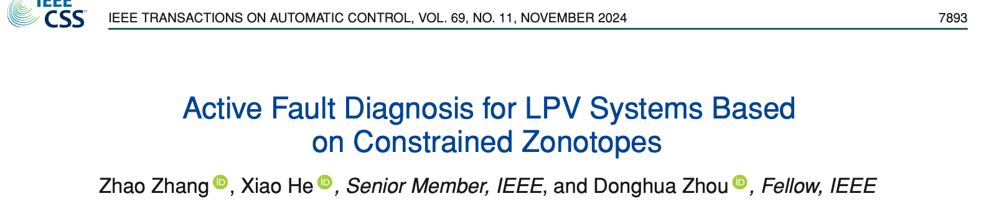
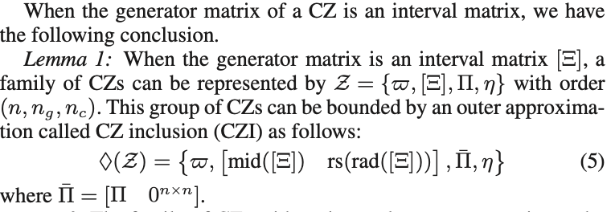
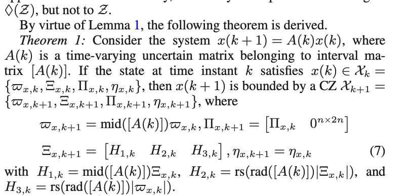
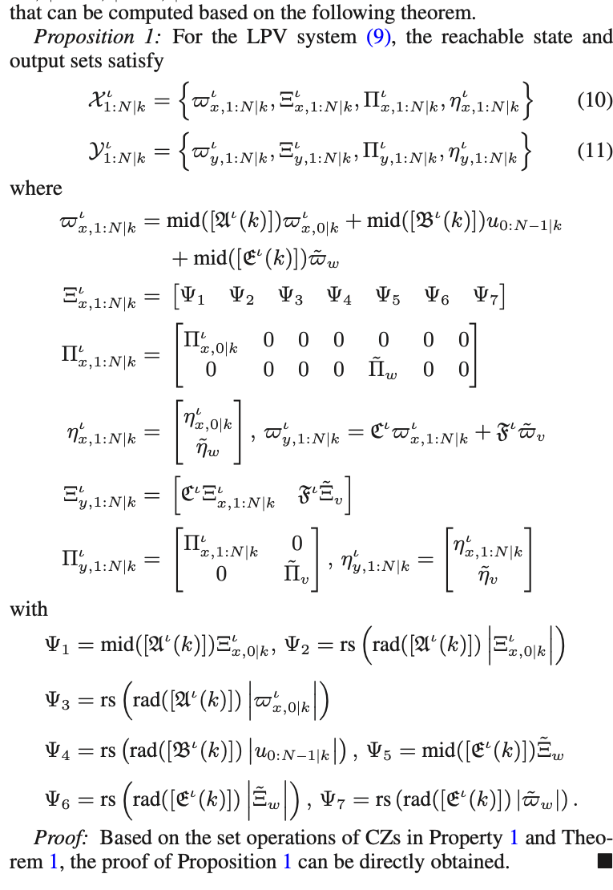
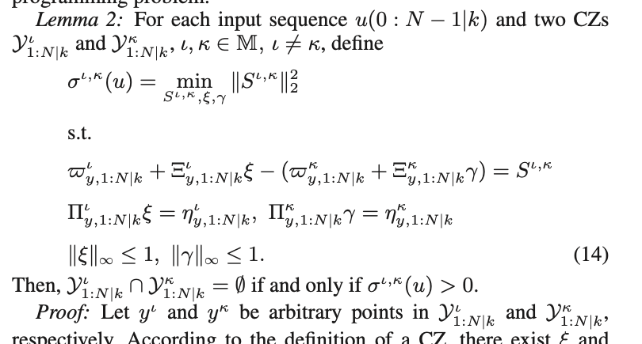
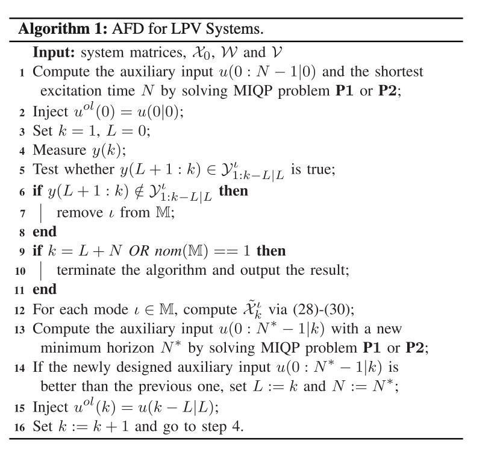
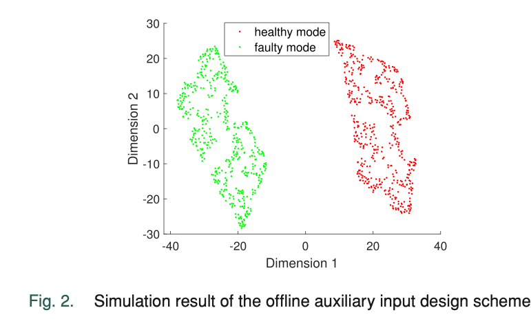
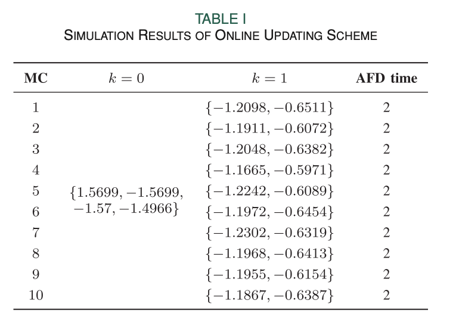
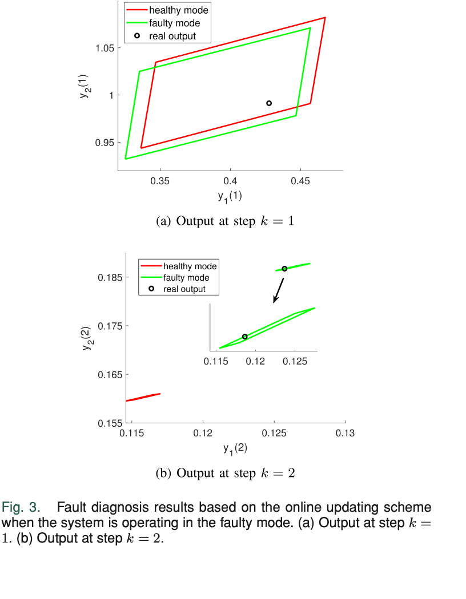

# 基于约束 Zonotope 的 LPV 系统主动故障诊断

- 关键词：主动故障诊断；LPV 系统；辅助输入；约束 zonotope；集合值观测器；混合整数二次规划；在线更新
- DOI / 论文链接：https://doi.org/10.1109/TAC.2024.3401271

## 1. 研究背景、问题定义与核心思路
### 1.1 为何 LPV 系统的主动故障诊断更依赖可达集预测

主动故障诊断的目标不是被动等待故障特征出现，而是设计一段辅助输入，把不同系统模式的输出响应主动拉开。如果真实输出只落在某一个模式的理论输出集合中，故障模式就能被确定。这一思想在 LTI 系统中已有较成熟的 zonotope 或多面体实现，但 LPV 系统多了一层难点：系统矩阵依赖调度参数，未来调度参数通常无法精确知道，只能根据当前值、参数范围和变化率范围去预测。

这种不确定性会直接放大未来输出集合。若辅助输入在初始时刻一次性设计并按序注入，后续已经观测到的系统输出没有被利用，诊断时域往往偏保守。另一类方法只追求不同输出集合的“分散性”，不强制输出集合互不相交，因而不能给出确定诊断保证。本文选择一条更硬的路线：用约束 zonotope 描述状态、扰动、噪声和输出集合，设计最小能量辅助输入，使不同模式的预测输出集合在指定时域内分离，并在诊断过程中用实时输出重新设计输入。

### 1.2 方法框架与核心思路

论文考虑离散时间 LPV 多模式系统：

$$
\begin{aligned}
x^\iota(k+1)
&=
A^\iota(\rho(k))x^\iota(k)
+B^\iota(\rho(k))u(k)
+E^\iota(\rho(k))w(k),\\
y^\iota(k)
&=
C^\iota x^\iota(k)+F^\iota v(k),
\end{aligned}
$$

其中 $\iota\in\mathcal M=\{0,1,\ldots,n_s\}$ 是模式标签，$\iota=0$ 表示正常模式，其余标签表示不同故障模式。$w(k)$ 和 $v(k)$ 是未知但有界的过程扰动与测量噪声，调度参数 $\rho(k)$ 当前值可得，未来值只知道落在由参数边界与变化率边界诱导出的集合中。

约束 zonotope 写作

$$
\mathcal Z=\{\varpi+\Xi\xi:\|\xi\|_\infty\le 1,\ \Pi\xi=\eta\}.
$$

它比普通 zonotope 多了线性等式约束 $\Pi\xi=\eta$，能保留更多集合结构。论文用它描述 $x^\iota(0)$、$w(k)$、$v(k)$，再推导 LPV 系统在不确定调度参数下的未来状态集合 $\mathcal X^\iota_{1:N|k}$ 与输出集合 $\mathcal Y^\iota_{1:N|k}$。辅助输入的核心条件是

$$
\mathcal Y^\iota_{1:N|k}\cap \mathcal Y^\kappa_{1:N|k}=\emptyset,\qquad
\iota,\kappa\in\mathcal M,\ \iota\ne\kappa.
$$

在这个条件下，真实输出序列若只属于一个候选模式的输出集合，就能确定当前模式。作者同时最小化输入能量

$$
J(u)=\sum_{i=0}^{N-1}u(i|k)^T R u(i|k),
$$

并加入输入约束与输出安全约束，避免辅助信号为了“激发故障差异”而损害系统运行。

### 1.3 主要创新点

最核心的贡献是给出了 LPV 不确定矩阵作用于约束 zonotope 时的外包络传播规则。调度参数未来值不确定时，$A^\iota(i|k)$、$B^\iota(i|k)$ 和 $E^\iota(i|k)$ 都变成区间矩阵；若仍按确定矩阵做线性映射，未来状态可达集会失去保证。Lemma 1 和 Theorem 1 把“区间生成矩阵”和“区间系统矩阵”统一放进 CZ inclusion 框架，使后续输出可达集仍能用 CZ 表示。

辅助输入设计被建模为双层规划，这是本文的第二条主线。外层最小化输入能量，内层判断不同模式输出 CZ 之间的最小距离。论文用最优性条件替换内层二次规划，再用互补约束的二进制变量变换、变量替换和线性松弛，把问题转成可由 GUROBI 等工具求解的 MIQP。这个处理的代价是计算量不低，但它保留了“集合分离即可保证诊断”的逻辑。

在线更新方案让方法不再完全依赖初始预测。每个时刻先用集合值观测器根据最新输出收缩状态集合，再重新求解辅助输入；若新方案具有更短诊断时域或更低能量，就替换旧输入，否则沿用上一轮保存的输入。这个选择机制使在线策略至少不劣于初始离线策略。

## 2. 核心方法与技术主线解析
### 2.1 整体技术路线

未来调度参数集合先由当前值和变化率集合递推得到：

$$
\tilde{\mathcal P}_{i|k}=\mathcal P_{i-1|k}+d\mathcal P,\qquad
\hat{\mathcal P}_{i|k}=\tilde{\mathcal P}_{i|k}\cap\mathcal P,\qquad
\mathcal P_{i|k}=\operatorname{Zo}(\hat{\mathcal P}_{i|k}).
$$

由于系统矩阵仿射依赖 $\rho(k)$，预测矩阵可写成区间矩阵 $[A^\iota(i|k)]$、$[B^\iota(i|k)]$、$[E^\iota(i|k)]$。在预测时域内，论文使用

$$
\begin{aligned}
x^\iota(i+1|k)
&=
A^\iota(i|k)x^\iota(i|k)
+B^\iota(i|k)u(i|k)
+E^\iota(i|k)w(i|k),\\
y^\iota(i|k)
&=
C^\iota x^\iota(i|k)+F^\iota v(i|k),
\end{aligned}
$$

并通过迭代得到增广形式：

$$
\begin{aligned}
x^\iota(1:N|k)
&=
\mathcal A^\iota(k)x^\iota(0|k)
+\mathcal B^\iota(k)u(0:N-1|k)
+\mathcal E^\iota(k)w(0:N-1|k),\\
y^\iota(1:N|k)
&=
\mathcal C^\iota x^\iota(1:N|k)+\mathcal F^\iota v(1:N|k).
\end{aligned}
$$

这组公式是整个方法的骨架：只有先把每个候选模式在未来 $N$ 步的输出集合算出来，后面的集合分离约束和辅助输入优化才有明确对象。

### 2.2 关键技术块解析

**Lemma 1** 处理的是 CZ 生成矩阵本身为区间矩阵的情况。若

$$
\mathcal Z=\{\varpi,[\Xi],\Pi,\eta\},
$$

则它可以由 CZ inclusion 外包为

$$
\diamond(\mathcal Z)
=
\left\{
\varpi,
\left[\operatorname{mid}([\Xi])\quad
\operatorname{rs}(\operatorname{rad}([\Xi]))\right],
\bar{\Pi},
\eta
\right\},
\qquad
\bar{\Pi}=\left[\Pi\quad 0^{n\times n}\right].
$$

这一步把区间不确定性转化成额外生成元。它不是精确等价，尤其当 $\Pi\xi=\eta$ 存在时会引入外包保守性；但它让后续集合仍保持 CZ 形式，避免在 LPV 预测中退化为难以操作的一般非线性集合。

**Theorem 1** 把 Lemma 1 推进到状态传播。若 $x(k)\in\mathcal X_k=\{\varpi_{x,k},\Xi_{x,k},\Pi_{x,k},\eta_{x,k}\}$，且 $A(k)\in[A(k)]$，则 $x(k+1)$ 可被 $\mathcal X_{k+1}$ 外包，其中

$$
\begin{aligned}
\varpi_{x,k+1}
&=
\operatorname{mid}([A(k)])\varpi_{x,k},\\
\Xi_{x,k+1}
&=
\left[H_{1,k}\quad H_{2,k}\quad H_{3,k}\right],\\
\Pi_{x,k+1}
&=
\left[\Pi_{x,k}\quad 0^{n\times 2n}\right],\qquad
\eta_{x,k+1}=\eta_{x,k},
\end{aligned}
$$

其中

$$
\begin{aligned}
H_{1,k}&=\operatorname{mid}([A(k)])\Xi_{x,k},\\
H_{2,k}&=\operatorname{rs}(\operatorname{rad}([A(k)])|\Xi_{x,k}|),\\
H_{3,k}&=\operatorname{rs}(\operatorname{rad}([A(k)])|\varpi_{x,k}|).
\end{aligned}
$$

这个定理的作用很直接：$H_{1,k}$ 传播原有 CZ 生成元，$H_{2,k}$ 覆盖区间矩阵与原生成元相乘带来的不确定性，$H_{3,k}$ 覆盖区间矩阵作用于中心点时产生的附加半径。没有这三个块，LPV 调度参数的未来不确定性无法进入可达集计算。

在 Theorem 1 的基础上，**Proposition 1** 给出整个预测时域内的状态集合与输出集合：

$$
\mathcal X^\iota_{1:N|k}
=
\{\varpi^\iota_{x,1:N|k},\Xi^\iota_{x,1:N|k},
\Pi^\iota_{x,1:N|k},\eta^\iota_{x,1:N|k}\},
$$

$$
\mathcal Y^\iota_{1:N|k}
=
\{\varpi^\iota_{y,1:N|k},\Xi^\iota_{y,1:N|k},
\Pi^\iota_{y,1:N|k},\eta^\iota_{y,1:N|k}\}.
$$

这条命题是从集合传播走向主动诊断的接口。它把初始状态、过程扰动、测量噪声、输入序列和调度参数不确定性全部合并到 $\mathcal Y^\iota_{1:N|k}$ 中。后面优化问题只需比较不同 $\iota$ 的输出 CZ 是否相交。

辅助输入优化的关键是把“两个 CZ 不相交”变成可计算条件。**Lemma 2** 定义两个模式输出集合之间的最小平方距离：

$$
\begin{aligned}
\sigma^{\iota,\kappa}(u)
&=
\min_{S^{\iota,\kappa},\xi,\gamma}
\|S^{\iota,\kappa}\|_2^2\\
\text{s.t.}\quad
&\varpi^\iota_y+\Xi^\iota_y\xi
-
(\varpi^\kappa_y+\Xi^\kappa_y\gamma)
=S^{\iota,\kappa},\\
&\Pi^\iota_y\xi=\eta^\iota_y,\qquad
\Pi^\kappa_y\gamma=\eta^\kappa_y,\\
&\|\xi\|_\infty\le 1,\qquad
\|\gamma\|_\infty\le 1.
\end{aligned}
$$

结论是 $\mathcal Y^\iota_{1:N|k}\cap\mathcal Y^\kappa_{1:N|k}=\emptyset$ 当且仅当 $\sigma^{\iota,\kappa}(u)>0$。为了获得闭可行域，论文把它替换为 $\sigma^{\iota,\kappa}(u)\ge \bar{\sigma}^{\iota,\kappa}$，其中阈值为给定正数。这样会稍微保守，但只要约束满足，输出集合分离仍然成立。

原问题由此成为双层规划：外层求最小能量输入，内层求两个输出 CZ 的最小距离。论文用 KKT 条件替换内层二次规划，互补约束再用二进制变量和 big-M 线性化。由于 $\Xi^\iota_{y,1:N|k}$ 中含有 $|u(0:N-1|k)|$，作者给了两种处理方式：P1 通过引入 $h_i=|u_i|$ 并对双线性项做 LP 松弛；P2 用 $u_{\max}$ 替换绝对值项，计算更轻但更保守。仿真部分采用的是 P2。

在线更新建立在集合值观测器上。每个时刻先预测，再用真实输出筛选测量一致状态，最后外包二者交集：

$$
\hat{\mathcal X}^\iota_k
=
A^\iota(k-1)\tilde{\mathcal X}^\iota_{k-1}
+B^\iota(k-1)u(k-1)
+E^\iota(k-1)\mathcal W,
$$

$$
\check{\mathcal X}^\iota_k
=
\{x^\iota_k:C^\iota x^\iota(k)\in y(k)+(-F^\iota\mathcal V)\},
$$

$$
\tilde{\mathcal X}^\iota_k
\supseteq
\hat{\mathcal X}^\iota_k\cap\check{\mathcal X}^\iota_k.
$$

Algorithm 1 的选择机制并不盲目重算。若新求得的辅助输入带来更短诊断时域或更小能量，算法才保存并注入新输入；否则继续执行上一轮方案。这个设计让实时输出信息进入诊断，同时避免一次保守外包导致在线更新反而变差。

## 3. 仿真结果与对比分析

论文使用一个二维离散 LPV 数值模型验证方法。正常模式与故障模式具有不同的 $A^\iota(k)$、$B^\iota(k)$、$C^\iota$，扰动和测量噪声均由 CZ 描述，输入满足 $|u_k|\le 1.5708$。调度参数 $\rho_1,\rho_2$ 只在当前时刻可得，未来值通过参数边界与变化率边界预测。考虑计算复杂度，作者采用 P2 求辅助输入。

离线方案得到的辅助输入为

$$
\{1.5699,\ -1.5699,\ -1.57,\ -1.4966\},
$$

对应诊断时域为 4 步。由于 4 步输出集合维度为 8，论文用 500 次 Monte Carlo 采样和 t-SNE 把正常模式与故障模式的高维输出映射到二维平面。

Fig. 2 中正常模式与故障模式样本云在二维可视化空间里分离，没有重叠。这说明求得的辅助输入确实能把两种模式的输出响应拉开。t-SNE 只用于可视化，不是诊断算法本身；真正的诊断保证仍来自输出 CZ 的集合分离约束。

在线更新的效果由 10 次 Monte Carlo 实验给出。初始时刻仍使用离线求得的 4 步输入，但在 $k=1$ 后利用实时输出重新估计状态并重算输入。

Table I 的结果很明确：10 次实验的 AFD time 全部为 2。相比离线方案的 4 步，在线更新把诊断时域减半。表中 $k=1$ 列给出了每次重算后的两步输入，说明改进不是单次偶然结果，而是在不同采样扰动下都发生。

Fig. 3 展示了一次在线诊断过程。在 $k=1$ 时，真实输出点仍同时落在正常模式与故障模式输出集合内，不能判定模式；利用该输出更新状态集合后，算法重算辅助输入。到 $k=2$ 时，真实输出只位于故障模式输出集合中，诊断完成。这个例子支撑了论文关于“实时输出能降低保守性”的主张，但证据范围仍有限：仿真只覆盖一个数值模型，和已有 LPV AFD 方法的比较主要是定性论证，复杂系统上的 MIQP 求解成本还需要更系统的评估。

## 4. 后续研究方向
1. 如果你刚开始读这篇文章  
   *核心想法：先读系统模型 (4)、CZ 定义、Lemma 1 和 Proposition 1；只要理解输出可达集怎样形成，后面的优化问题就不会散。*  
   数学推导难度：中等，核心是区间矩阵、CZ 线性映射和外包络传播。
2. 如果你想继续往下深挖  
   *核心想法：优先研究 P2 的保守性来源，尝试在不显著增加二进制变量的前提下收紧 $|u|$ 替换带来的外包。*  
   数学推导难度：较高，需要混合整数优化、双线性松弛和集合外逼近误差分析。
3. 如果你要带学生做这条线  
   *核心想法：可以先复现 Table I，再让学生分别替换 CZ 降阶策略、输入约束和在线选择准则，观察诊断时域与计算时间的变化。*  
   数学推导难度：中等偏高，适合作为从集合估计过渡到主动诊断优化的阶段性课题。

## 5. 总结与评价

这篇论文的核心判断是：LPV 主动故障诊断不能只设计一次辅助输入，还要把调度参数不确定性和实时输出信息同时纳入集合预测。CZ inclusion、输出集合分离和 MIQP 转化构成了可证明诊断的主线，仿真结果支持在线更新能显著缩短诊断时域。方法的边界也清楚，模型精度是前提，复杂系统中的 MIQP 规模可能成为主要瓶颈。后续工作若能把保守性和计算复杂度同时压下来，这条路线会更接近工程可用。
